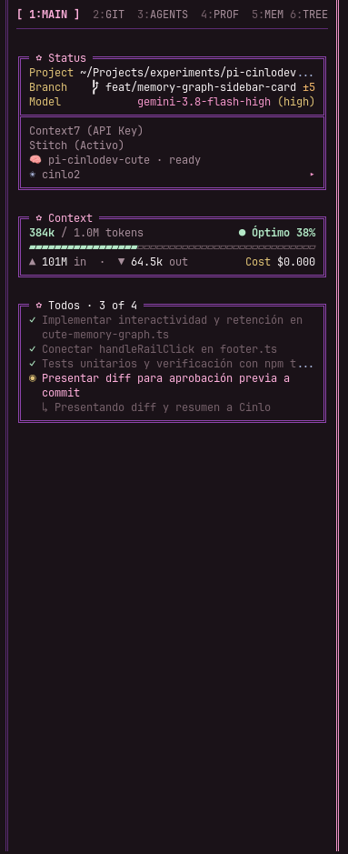
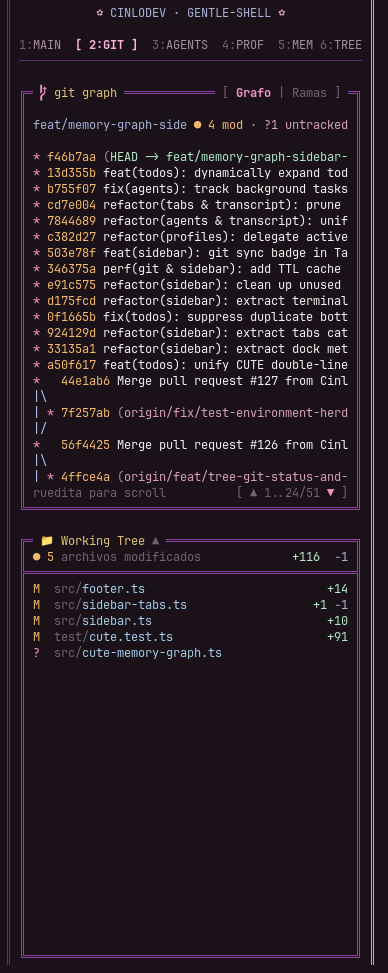
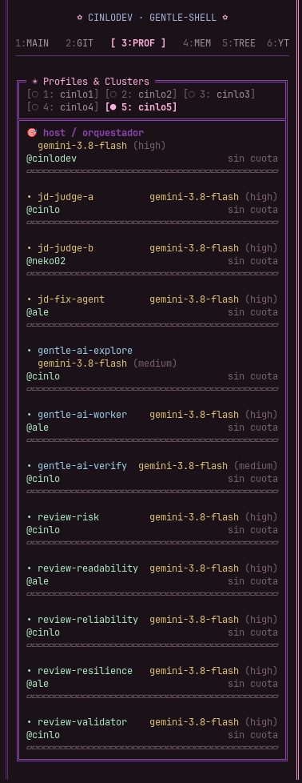
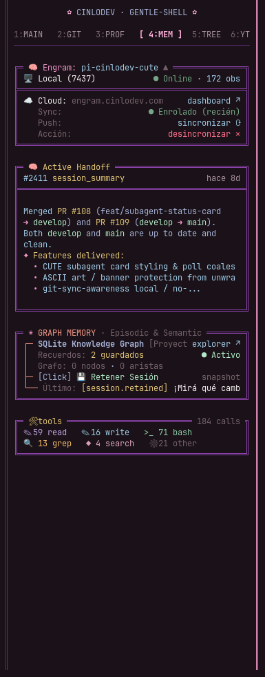
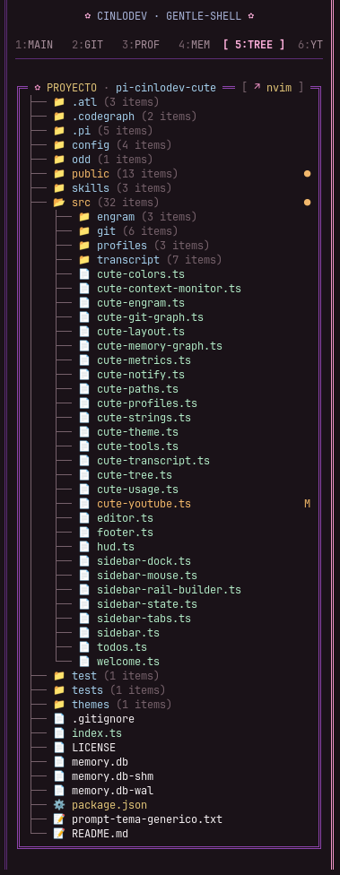
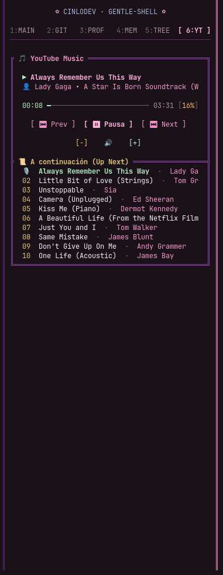

<p align="center">
  <h1 align="center">🌸 pi-cinlodev-cute 💜</h1>
  <p align="center">
    <strong>An exclusive high-density visual suite, aesthetic theme pack, Dracula syntax engine, and live telemetry multi-tab sidebar for Pi Coding Agent and la Gentlewoman.</strong>
  </p>
</p>

<p align="center">
  
</p>

<p align="center">
  <a href="#-overview">Overview</a> •
  <a href="#-sidebar-tabs-showcase">Sidebar Tabs</a> •
  <a href="#-design-highlights">Highlights</a> •
  <a href="#-interactive-cards-reference">Cards Reference</a> •
  <a href="#-installation">Installation</a> •
  <a href="#-navigation--mouse-controls">Controls</a> •
  <a href="#-user-overrides--customization">Customization</a>
</p>

---

## ✨ Overview

**`pi-cinlodev-cute`** elevates the [Pi Coding Agent](https://github.com/earendil-works/pi) terminal experience into a cohesive, elegant, and responsive developer workspace. Designed with the distinctive **Cinlodev CUTE** aesthetic—deep obsidian backdrops, double violet structural rails, pastel pink accents, warm golden highlights, and Dracula syntax coloring—it combines visual delight with senior-grade density.

Whether running standalone or paired with the **la Gentlewoman** / **Gentle AI** ecosystem, `pi-cinlodev-cute` provides live telemetry across a multi-tab sidebar rail, effort-aware prompt framing, persistent ambient monitoring, and unified Dracula tool transcript cards.

---

## 🎛️ Sidebar Tabs Showcase (`1:MAIN` → `6:YT`)

The sidebar rail (`railWidth: 52`) organizes all session vital information into an interactive 6-tab navigation bar (`CUTE_SIDEBAR_TABS`), navigable via mouse click or scroll-wheel cycling:

<table>
  <tr>
    <td width="33%" align="center">
      <strong>1:MAIN · Dashboard</strong><br/><br/>
      <br/><br/>
      <sub>Project status, model details, real-time token gauge, and dynamic full-height Todos checklist.</sub>
    </td>
    <td width="33%" align="center">
      <strong>2:GIT · Graph & Diff</strong><br/><br/>
      <br/><br/>
      <sub>50/50 split view with ASCII Dracula commit graph and clickable Working Tree diff inspector.</sub>
    </td>
    <td width="33%" align="center">
      <strong>3:PROF · Profiles & Quotas</strong><br/><br/>
      <br/><br/>
      <sub>Multi-account model profiles, subagents roster, interactive switcher, and live provider quota semaphores.</sub>
    </td>
  </tr>
  <tr>
    <td width="33%" align="center">
      <strong>4:MEM · Memory Vault</strong><br/><br/>
      <br/><br/>
      <sub>Local Engram daemon, handoffs, tools metrics, and interactive SQLite Knowledge Graph card.</sub>
    </td>
    <td width="33%" align="center">
      <strong>5:TREE · Project Explorer</strong><br/><br/>
      <br/><br/>
      <sub>Interactive directory tree with live Git status badges (M, ?, ●), directory toggling, and editor launcher.</sub>
    </td>
    <td width="33%" align="center">
      <strong>6:YT · YouTube Music</strong><br/><br/>
      <br/><br/>
      <sub>Native player widget powered by <a href="https://github.com/CinloDev/pi-youtube-player">pi-youtube-player</a> with live progress scrubber, centered controls, and active track indicator (🎙️).</sub>
    </td>
  </tr>
</table>

---

## 🎨 Design Highlights

### 1. 🌸 Cinlodev CUTE Theme (`themes/CinlodevCute.json`)
* **Deep Obsidian Canvas:** `#1A1218` main background and subtle `#241822` element surfaces.
* **Double-Rail Violet Borders:** Signature `#8e44ad` framing with `#5c2c74` subtle separators.
* **Pastel Rose Accents:** `#F095C8` (active accent), `#FFB1DD` (bright pastel pink highlights & custom block cursor), `#D7A0B8` (secondary).
* **Warm Gilding & Notices:** `#E0C27A` (headings, user messages, thinking badges), `#F2B86D` (git dirty counts, package warnings), and `#B4E7C7` (success green).

---

### 2. 👑 Welcome Dashboard (`src/welcome.ts`)

<p align="center">
  
</p>

> 💡 **Demonstration Notice:** The animated *Neko-pi* pixel art mascot shown in the welcome screen screenshot is an optional personal extension used here for illustration and demonstration purposes; it is not bundled in this base theme pack.

* High-density header showing Pi version, active Git branch, model, thinking profile, active context files, and loaded skills/extensions.
* **Expandable on demand:** Toggle between compact and full dashboard with `Ctrl+O` or `/welcome`.
* Symmetric double-line border with custom Unicode glyphs (`╔═ ◆ Cinlodev CUTE · la Gentlewoman ═╗`).

---

### 3. ✿ Double-Line Effort-Aware Prompt Editor (`src/editor.ts`)
* **Double Frame:** Seamlessly wraps your command input at full terminal width, perfectly aligned with native Pi cards.
* **Effort-Aware Dynamic Frame:** The border color follows your active thinking level—mint `#B4E7C7` for low/minimal, gold `#E0C27A` for medium, violet `#8e44ad` for high/max—repainting live when you cycle with `Shift+Tab`.
* **Animated Status Indicator:** The petal icon spins through animated frames (`✿` → `❀` → `❁` → `✾`) while executing, or switches to expressive kaomojis (`/(xx)\_` / `preset: cats`) according to your configured preset.
* **Pastel Pink Cursor:** Inverted block cursor styled in `#FFB1DD` pastel pink with 1 column of breathing room from the left rail (`║ █`).
* **Clipping-Safe Frame:** Renders with a 1-column safety margin so the terminal never clips the closing corner (`╗`).

---

### 4. 📜 Dracula Transcript & Minimalist Statusline (`src/cute-transcript.ts` & `src/footer.ts`)

<p align="center">
  
</p>

* **Dracula Syntax Highlighting:** Commands, bash outputs, code blocks, `read` files, `grep` matches, and diff views (`write`/`edit`) are syntax-highlighted in rich Dracula tones.
* **Intelligent Multi-Call Grouping:** Consecutive `bash`, `write`, `mem_*`, or error executions are automatically grouped into a single unified card to eliminate transcript clutter.
* **Pastel Category Framing:**
  * 🌿 **Mint:** Shell executions (`bash`)
  * 🪻 **Lilac:** File inspections (`read`)
  * 🧊 **Light Blue:** Code modifications (`write`, `edit`)
  * 🌹 **Dusty Rose:** Web searches (`web_search`)
  * 🌸 **Pastel Pink:** Content retrieval (`fetch_content`)
  * 🍣 **Salmon:** Persistent memory (`mem_*`, `graph_mem_*`)
  * 🪸 **Coral:** Errors and exceptions
* **Assistant Prose & User Boxes:** Assistant text is styled in soft celeste for zero eye fatigue; user inputs are wrapped in warm golden boxes (`E0C27A`).
* **CUTE Minimalist Statusline Footer:** Single-line responsive dock showing branch, model, context gauge, cost, MCP status, and working tree changes (`8 files · +830 -38 /gentle:changes`). Auto-compacts gracefully on narrow splits.

---

## 🧩 Interactive Cards Reference

| Component | Tab | Description |
| :--- | :---: | :--- |
| **Status Card** | `1:MAIN` | Project path, Git branch with dirty count, active Model/Effort, Context7 & Stitch indicators, and active profile badge. |
| **Context Gauge Card** | `1:MAIN` | Real-time token usage gauge with 4-tier semáforo thresholds (mint → yellow → orange → coral), In/Out token counters, and accumulated session cost. |
| **Todos Mirror Card** | `1:MAIN` | Dynamic full-height task mirror of Pi's todo list. Automatically expands to consume available vertical space down to the prompt line with clean word wrapping and delayed mouse wheel scrolling. |
| **Git Graph Card** | `2:GIT` | ASCII Git graph with Dracula branch styling, commit hashes, branch tags, and scrollable history. Shares a 50/50 split view with Working Tree. |
| **Working Tree Card** | `2:GIT` | Live list of staged, modified, and untracked files with addition/deletion stats. Click any file to inspect diffs or launch the external viewer. |
| **Profiles Extended Card** | `3:PROF` | Interactive cluster profile switcher (Alt+M / click to switch), listing orchestrator models, subagents roster, and quota bars with weekly/5h limits. |
| **Engram Card** | `4:MEM` | Local Engram daemon health (`localhost:7437`), observation counts, cloud sync status, and click target to launch the web dashboard (`dashboard ↗`). |
| **Active Handoff Card** | `4:MEM` | Formatted preview of the active session summary or memory handoff for seamless context continuity across sessions. |
| **Memory Graph Card** | `4:MEM` | SQLite knowledge graph card for `pi-memory-graph`. Displays memories count, relational nodes/edges, active leases, last memory snippet, `[explorer ↗]` browser launcher (port 7474), and one-click `[💾 Retener Sesión]`. |
| **Tools Telemetry Card** | `4:MEM` | Live counter summarizing tool execution metrics (`read`, `write`, `bash`, `grep`, `other`) into clean visual pills with total call count. |
| **Project Tree Card** | `5:TREE` | Interactive directory tree with Git porcelain badges (`M`, `?`, `●`), directory collapse/expand toggles, mouse-wheel scrolling, and direct click-to-edit in `$EDITOR` (`[ ↗ nvim ]`). |
| **YouTube Music Card** | `6:YT` | Interactive YouTube Music player integrated via [pi-youtube-player](https://github.com/CinloDev/pi-youtube-player). Displays track info, live scrubber timeline, centered transport controls (`[ ⏮  Prev ]`, `[ ⏸  Pausa ]`, `[ ⏭  Next ]`), volume step controls (`[-]`, `[+]`), and clickable Up Next queue with live active track indicator (`🎙️`). |

---

## ⌨️ Navigation & Mouse Controls

| Input / Action | Context | Description |
| :--- | :--- | :--- |
| **Click Tab** | TabBar | Switch active sidebar tab (`1:MAIN`, `2:GIT`, `3:PROF`, `4:MEM`, `5:TREE`, `6:YT`). |
| **Mouse Wheel** | TabBar | Cycle through sidebar tabs forward or backward. |
| **Mouse Wheel** | Over Cards | Scroll vertically inside overflowing cards (Todos, Git Graph, Tree, Profiles, Queue). |
| **Click File** | `2:GIT` / `5:TREE` | Open file directly in configured editor (`$EDITOR` or `nvim`). |
| **Click Media Controls** | `6:YT` | Toggle playback (`Play` / `Pausa`), skip track (`Next` / `Prev`), and increase/decrease volume (`[+]` / `[-]`). |
| **Click Queue Track** | `6:YT` | Jump immediately to any upcoming song in the Up Next queue. |
| **Click `[explorer ↗]`** | `4:MEM` | Launch `pi-memory-graph` Cytoscape interactive graph explorer in the browser (port 7474). |
| **Click `[💾 Retener]`**| `4:MEM` | Extract current session takeaways and persist a durable memory record into `.pi/memory.db`. |
| **Click `[dashboard ↗]`**| `4:MEM` | Open Engram Cloud web dashboard for the current project. |
| **Click Profile** | `3:PROF` | Switch active model profile instantly without restarting Pi. |
| **`Shift+Tab`** | Input Editor | Cycle thinking effort level (mint: minimal/low, gold: medium, violet: high). |
| **`Alt+G`** | Anywhere | Launch `/gentle:changes` working tree interactive diff inspector. |
| **`Ctrl+O`** (`^O`) | Anywhere | Toggle full / compact Welcome Dashboard. |
| **`/cinlodev`** | Command | Hot-reload all CUTE configuration files and re-apply styles without restart. |

---

## 📦 Installation

Install directly into Pi via Git:

```bash
pi install git:github.com/CinloDev/pi-cinlodev-cute
```

Or for local development:

```bash
git clone https://github.com/CinloDev/pi-cinlodev-cute.git
pi install ./pi-cinlodev-cute
```

### 🧩 Compatibility
* **Standalone Pi:** Works 100% out of the box with standard `@earendil-works/pi-coding-agent`.
* **Ecosystem Companions:** Automatically lights up extra sidebar features when paired with:
  * [`gentle-shell`](https://github.com/Gentleman-Programming/gentle-shell) (Welcome dashboard, `/gentle:changes`, sidebar harmony).
  * [`gentle-engram`](https://github.com/Gentleman-Programming/gentle-engram) (Interactive memory card & cloud dashboard sync).
  * [`pi-memory-graph`](https://github.com/CinloDev/pi-memory-graph) (SQLite knowledge graph, local vector embeddings, Cytoscape explorer).
  * Antigravity / CLIProxyAPI (Live Gemini & Claude quota monitoring).

---

## 🎛️ User Overrides & Customization

All colors, strings, layout dimensions, and filesystem paths are cleanly separated in `config/CinlodevCute.*.json`. You can customize your workspace **without touching git files** by creating `~/.pi/agent/cute.json` (or `<cwd>/.pi/cute.json` for per-project settings). This ensures `pi update` never overwrites your personal configuration:

```json
{
  "user": "Cinlo",
  "persona": "gentlewoman",
  "preset": "kittens",
  "layout": {
    "sidebar": {
      "railWidth": 52,
      "defaultTab": "1"
    },
    "todos": {
      "railMaxRows": 20
    }
  }
}
```

### ✨ Configurable Options
* **Animation Presets (`"preset"`):**
  * `"petals"` (default spinning flower `✿` → `❀` → `❁` → `✾`)
  * `"kittens"` (mini kaomoji cat faces)
  * `"cats"` (expressive kaomojis `/(xx)\_`)
  * `"sparkles"` (`✨` → `❇` → `❈`)
  * `"stars"` (`★` → `☆` → `✦`)
  * `"hearts"` (`♥` → `♡` → `❥`)
  * `"ascii"` (standard ASCII animation for simple fonts)
* **Persona & Role (`"persona"` / `"userRole"`):**
  * `"persona": "gentlewoman"` (female agent mentor) or `"persona": "gentleman"`.
  * `"userRole"`: `"desarrolladora"`, `"desarrollador"`, or `"developer"`.
* **Dynamic User Placeholder (`"user"`):** Replaces `{user}` in UI headers. If omitted, it automatically resolves from `git config user.name` or your OS username.

---

## 🛡️ Architecture & Upstream Protection

`pi-cinlodev-cute` is built strictly as a non-destructive adapter:
* Hooks cleanly into standard Pi lifecycle events (`session_start`, `agent_start`, `agent_end`, `message_end`).
* Zero mutation of external source files or foreign state.
* Preserves all terminal escape sequences (OSC 133 / Kitty APC) atomically without breaking scroll or click semantics.

---

## 🌹 Built with Gentle-AI

`pi-cinlodev-cute` was crafted and engineered with the **[Gentle-AI](https://github.com/Gentleman-Programming/gentle-ai)** ecosystem—powered by Organic Driven Development (ODD), persistent Engram context, and strict verification discipline.

<p align="center">
  <a href="https://github.com/Gentleman-Programming/gentle-ai">
    
  </a>
</p>

---

<p align="center">
  <sub>Crafted with 💜 and 🌸 by Cinlo for Pi Coding Agent & la Gentlewoman.</sub>
</p>
