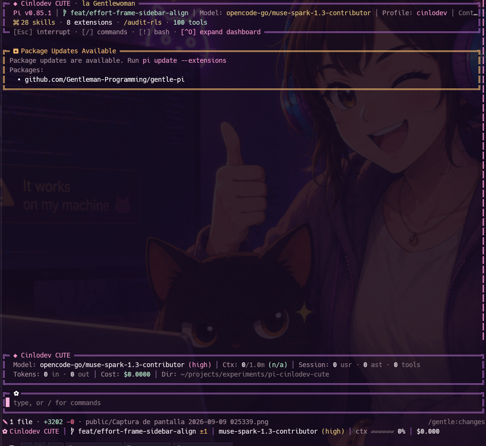
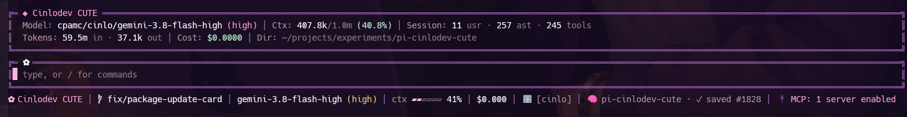

<p align="center">
  <h1 align="center">🌸 pi-cinlodev-cute 💜</h1>
  <p align="center">
    <strong>An exclusive, high-density visual suite, aesthetic theme pack, and custom TUI components for Pi Coding Agent and la Gentlewoman.</strong>
  </p>
</p>

<p align="center">
  
</p>

---

## ✨ Overview

**`pi-cinlodev-cute`** elevates the Pi Coding Agent terminal experience into a cohesive, elegant, and responsive developer workspace. Designed with the distinctive **Cinlodev CUTE** aesthetic—deep obsidian backdrops, double violet structural rails, pastel pink accents, and warm golden highlights—it combines visual delight with senior-grade density.

---

## 🎨 Design Highlights

<p align="center">
  
</p>

### 1. 🌸 Cinlodev CUTE Theme (`CinlodevCute.json`)
* **Deep Obsidian Canvas:** `#1A1218` main background and subtle `#241822` element surfaces.
* **Double-Rail Violet Borders:** Signature `#8e44ad` framing with `#5c2c74` subtle separators.
* **Pastel Rose Accents:** `#F095C8` (active accent), `#FFB1DD` (bright pink highlights & custom block cursor), `#D7A0B8` (secondary).
* **Warm Gilding & Notices:** `#E0C27A` (headings, user messages, thinking badges), `#F2B86D` (git dirty counts, package warnings), and `#B4E7C7` (success green).

### 2. 👑 la Gentlewoman Welcome Dashboard (`src/welcome.ts`)
* High-density header showing Pi version, active Git branch, model, thinking profile, active context files, and loaded skills/extensions.
* **Expandable on demand:** Toggle between compact and full dashboard with `Ctrl+O` or `/welcome`.
* Symmetric double-line border with custom Unicode glyphs (`╔═ ◆ Cinlodev CUTE · la Gentlewoman ═╗`).

### 3. 🎛️ Persistent HUD Widget (`src/hud.ts`)
* Sits one row below the transcript with a breathing line above it, providing continuous ambient feedback without polluting conversation history.
* Displays real-time model name, thinking level, context window token gauge, input/output token counts, session cost, active workspace path, and the active Git branch badge next to `Dir:` in secondary pink (`│  branch`).
* **Profile as icon + name:** shows the active model profile as `👤 name` (no brackets), fully tunable via `profileIcon` + `profileFormat`.
* **Modes:** Full (`/hud full`), Compact (`/hud compact`), or Hidden (`/hud off`).

### 4. ✿ Double-Line Effort-Aware Prompt Editor (`src/editor.ts`)
* Double frame (`╔═`, `║`, `╚═`) that wraps your command input seamlessly and renders at full width, aligned with native Pi cards.
* **Effort-Aware Frame:** The frame follows the thinking level — mint `#B4E7C7` for minimal/low, gold `#E0C27A` for medium, violet `#8e44ad` for high and up — repainting live when you cycle with `Shift+Tab`.
* **Animated Petal Indicator:** The flower icon spins through animated frames (`✿` → `❀` → `❁` → `✾`) with a muted `working` status whenever the agent executes a turn, resting peacefully in `✿` when idle.
* **Pastel Pink Cursor:** Inverted block cursor styled in `#FFB1DD` pastel pink (`\x1b[48;2;255;177;221m`), with one column of breathing room from the left rail (`║ █`).
* **Clipping-Safe Frame:** renders with a 1-column safety margin so the terminal never cuts the closing corner (`╗`).

### 5. 🎀 CUTE Minimalist Statusline Footer (`src/footer.ts`)
* Replaces the default status bar with a responsive, single-line dock:
  ```text
  ✿ Cinlodev CUTE │  branch ±N │ model (high) │ ctx ▰▰▱▱▱▱ 15% │ $0.000 │ MCP: ready
  ```
* **Intelligent Responsive Compaction:** Never wraps or breaks into multiple lines. On narrower splits (e.g. Herdr/tmux panes), it gracefully shortens branch names, drops secondary metrics, and compacts branding to keep your workspace clean.
* **Host Todos Mirror:** the sidebar rail mirrors the host Todos checklist (read-only) when the session provides todo state.

### 6. 🌸 Symmetrical Rails & Full-Height Divider (`src/sidebar.ts`)
* **Symmetrical Left Rail:** Mirrors the right-hand double violet vertical rail (`║`) along the entire left terminal edge.
* **Full-Height Middle Divider:** an explicit `║` column between body and sidebar spanning every terminal row, so the division never breaks above the input.
* **Equalized Sidebar Spacing:** rail geometry (`railWidth 52`, `railPadding 1`) tuned so sidebar cards breathe exactly like body cards.
* **Breathing Space (`║ `):** Insets the body, cards, prompt editor, and statusline by 1 column so content never looks abruptly cut off against the terminal bezel.
* **Dual-Mode Harmony:** Seamlessly active in both single-pane and wide multi-pane sidebar layouts.

### 7. ✎ Working-Tree Changes Cap (`lib/shell-changes.ts`)
* Intelligently caps the listed modified files at a maximum of 5, appending `+N más` for remaining files to prevent screen clutter on wide terminals.

### 8. 🎛️ Tunable Personalization Without Code Changes (`src/cute-*.ts` + `config/CinlodevCute.*.json`)
* **Non-destructive adapter:** the package transforms gentle-pi visuals without touching its files (e.g. it never deletes foreign state unless you opt in via `devBinaryHygiene`).
* **Zero hardcoded visuals:** every color, text, glyph, layout number and path resolves through `src/cute-theme.ts`, `src/cute-strings.ts`, `src/cute-layout.ts` and `src/cute-paths.ts`, with compiled defaults as fallback — delete a JSON key and the classic CUTE look stays.
* **`themes/CinlodevCute.json`** — palette (`vars`/`colors`) plus `glyphs`: `frameStyle` (`double`/`single`/`rounded`/`ascii`, with ASCII fallback for fonts without Nerd Font), frame corners, `branch`/`gauge`/`petalFrames`/`spinnerFrames` icons, and `profileIcon`.
* **`config/CinlodevCute.strings.json`** — every user-facing text: brand titles, persona placeholders (`{name}`/`{user}`/`{lang}`), `profileFormat` (`{icon} {name}`), editor hint, hotkeys, sidebar banner, todo titles, `/cinlodev` messages and all notifys.
* **`config/CinlodevCute.layout.json`** — geometry: sidebar rail (`breakpoint`, `railWidth`, `railPadding`, `gap`, borders), footer gauge/branch caps, HUD tiers + cache TTLs, todo row caps, welcome breakpoints, editor `paddingX`/pulse.
* **`config/CinlodevCute.paths.json`** — filesystem touchpoints (kept outside `themes/` on purpose: Pi rejects any non-theme JSON found there). `agentDir`, `profileActive`, `contextFiles`, `homeAlias`, `gitNoLabel`, `todoSource`, `devBinaryHygiene`.

#### 🐱 User Overrides (Persistent Across Updates)
To personalize your theme without modifying files inside the git repository — so `pi update --extensions` never overwrites your customizations — place an override file at `~/.pi/agent/cute.json` (or in `~/.pi/agent/cute/`):

```json
{
  "user": "YourName",
  "preset": "cats",
  "layout": {
    "sidebar": { "railWidth": 52 }
  }
}
```

* **Animation presets:** easily switch animations with `"preset": "cats"` (or `"kittens"`), `"petals"` (default), `"sparkles"` (or `"stars"`), `"hearts"`, or `"ascii"`. You can also supply custom `petalFrames` if you want your own kaomojis.
* **Dynamic `{user}`:** `user` replaces `{user}` placeholders across HUD, Header, Footer and persona instructions.
* Overrides merge on top of package defaults; omitted keys continue using official theme defaults. Project-level overrides in `<cwd>/.pi/cute.json` are also supported.

---

## 📦 Installation

Install directly into Pi via Git:

```bash
pi install git:github.com/CinloDev/pi-cinlodev-cute
```

Or for local development / testing:

```bash
pi install /path/to/pi-cinlodev-cute
```

---

## ⌨️ Slash Commands

| Command | Description |
| :--- | :--- |
| `/cinlodev` | Instantly re-applies and verifies all Cinlodev CUTE components (Header, HUD, Editor, Footer). |
| `/hud` | Configure persistent HUD above input (`/hud`, `/hud full`, `/hud compact`, `/hud off`). |
| `/welcome` | Toggle or configure the Welcome Dashboard (`/welcome full`, `/welcome compact`, `/welcome off`). |
| `/gentle:changes` | Open interactive two-pane diff viewer for modified working tree files (`Alt+G`). |

---

## 🛡️ Architecture & Upstream Protection

`pi-cinlodev-cute` is architected as an independent Pi extension package:
* It hooks into standard Pi lifecycle events (`session_start`, `agent_start`, `agent_end`).
* Your custom theme, HUD, editor, and statusline persist independently across `pi update` runs and upstream package resets.
* Mathematical border alignments ensure all UI components colocate symmetrically across all terminal dimensions.

---

<p align="center">
  <sub>Crafted with 💜 and 🌸 for Cinlo & la Gentlewoman.</sub>
</p>
