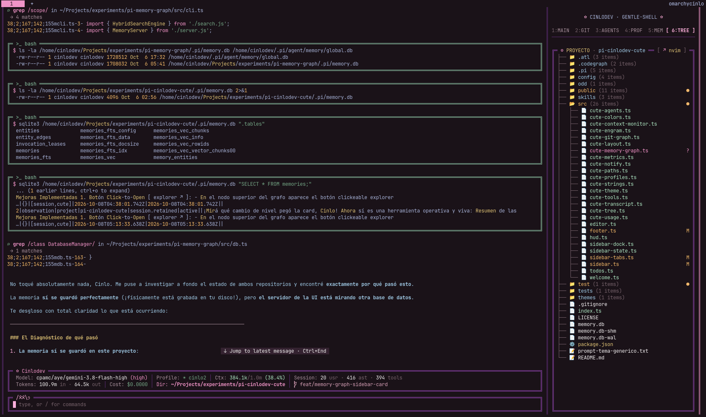
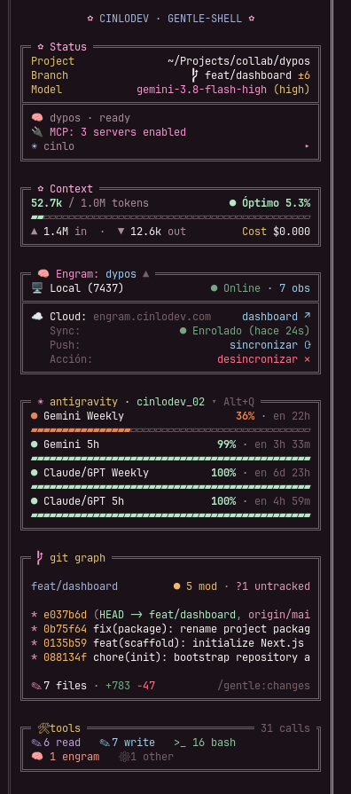
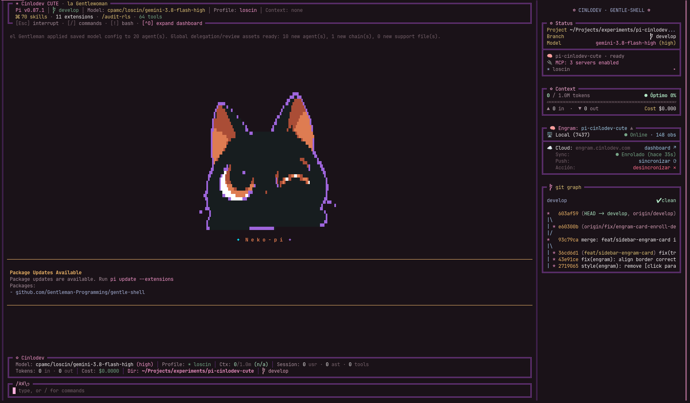
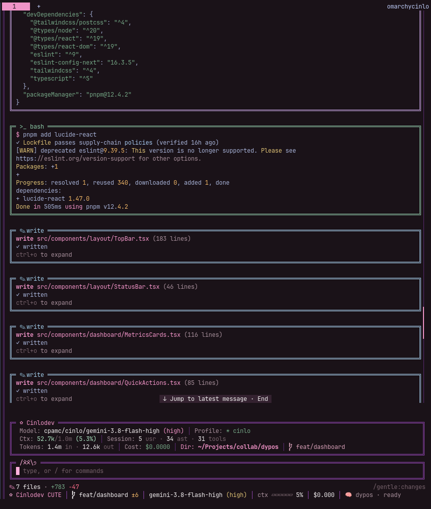

<p align="center">
  <h1 align="center">🌸 pi-cinlodev-cute 💜</h1>
  <p align="center">
    <strong>An exclusive high-density visual suite, aesthetic theme pack, Dracula syntax engine, and live telemetry sidebar for Pi Coding Agent and la Gentlewoman.</strong>
  </p>
</p>

<p align="center">
  
</p>

<p align="center">
  <a href="#-overview">Overview</a> •
  <a href="#-design-highlights">Highlights</a> •
  <a href="#-interactive-sidebar--telemetry-cards">Sidebar Cards</a> •
  <a href="#-installation">Installation</a> •
  <a href="#-shortcuts--cheat-sheet">Hotkeys</a> •
  <a href="#-user-overrides--customization">Customization</a>
</p>

---

## ✨ Overview

**`pi-cinlodev-cute`** elevates the [Pi Coding Agent](https://github.com/earendil-works/pi) terminal experience into a cohesive, elegant, and responsive developer workspace. Designed with the distinctive **Cinlodev CUTE** aesthetic—deep obsidian backdrops, double violet structural rails, pastel pink accents, warm golden highlights, and Dracula syntax coloring—it combines visual delight with senior-grade density.

Whether running standalone or paired with the **la Gentlewoman** / **Gentle AI** ecosystem, `pi-cinlodev-cute` provides live telemetry, effort-aware prompt framing, persistent ambient monitoring, and unified tool transcript cards.

---

## 🎨 Design Highlights

### 1. 🌸 Cinlodev CUTE Theme (`themes/CinlodevCute.json`)
* **Deep Obsidian Canvas:** `#1A1218` main background and subtle `#241822` element surfaces.
* **Double-Rail Violet Borders:** Signature `#8e44ad` framing with `#5c2c74` subtle separators.
* **Pastel Rose Accents:** `#F095C8` (active accent), `#FFB1DD` (bright pastel pink highlights & custom block cursor), `#D7A0B8` (secondary).
* **Warm Gilding & Notices:** `#E0C27A` (headings, user messages, thinking badges), `#F2B86D` (git dirty counts, package warnings), and `#B4E7C7` (success green).

---

### 2. 🎛️ Interactive Sidebar & Telemetry Cards (`src/sidebar.ts`)

<p align="center">
  
</p>

The sidebar rail (`railWidth: 52`) organizes your session vitals into dedicated, auto-updating cards:

* **👑 Status Card:** Shows active Project path, Git branch with dirty count, active Model and thinking level, MCP server count, and active profile.
* **🧠 Context Gauge Card:** Real-time token progress bar with dynamic semáforo thresholds (mint → yellow → orange → coral), In/Out token counters, and accumulated session cost.
* **🧠 Engram Memory Card (`src/cute-engram.ts`):** Live status of your local Engram daemon (`Local · Online · N obs`), cloud synchronization status (`engram.cinlodev.com`), direct dashboard shortcut (`dashboard ↗`), and interactive enroll/sync controls.
* **⚡ Quotas & Usage Tracker Card (`src/cute-usage.ts`):** Displays real-time API quota limits for Gemini and Claude/GPT models (5h and weekly windows), dynamic 4-tier semáforo gauges, and reset countdowns (`en 3h 33m`). Toggle anytime with **`Alt+Q`**.
* **🌿 Enhanced Git Graph Card (`src/cute-git-graph.ts`):** Renders an ASCII commit history graph with Dracula branch styling, dirty file counts (`5 mod · ?1 untracked`), session diff summary (`+783 -47`), and interactive `/gentle:changes` viewer hint.
* **🛠️ Live Tools Telemetry Card (`src/cute-tools.ts`):** Summarizes tool execution metrics (`read`, `write`, `bash`, `engram`, `other`) into clean visual pills with total call count (`31 calls`).

---

### 3. 👑 Welcome Dashboard (`src/welcome.ts`)

<p align="center">
  
</p>

> 💡 **Demonstration Notice:** The animated *Neko-pi* pixel art mascot shown in the welcome screen screenshot is an optional personal extension used here for illustration and demonstration purposes; it is not bundled in this base theme pack.

* High-density header showing Pi version, active Git branch, model, thinking profile, active context files, and loaded skills/extensions.
* **Expandable on demand:** Toggle between compact and full dashboard with `Ctrl+O` or `/welcome`.
* Symmetric double-line border with custom Unicode glyphs (`╔═ ◆ Cinlodev CUTE · la Gentlewoman ═╗`).

---

### 4. ✿ Double-Line Effort-Aware Prompt Editor (`src/editor.ts`)
* **Double Frame:** Seamlessly wraps your command input at full terminal width, perfectly aligned with native Pi cards.
* **Effort-Aware Dynamic Frame:** The border color follows your active thinking level—mint `#B4E7C7` for low/minimal, gold `#E0C27A` for medium, violet `#8e44ad` for high/max—repainting live when you cycle with `Shift+Tab`.
* **Animated Status Indicator:** The petal icon spins through animated frames (`✿` → `❀` → `❁` → `✾`) while executing, or switches to expressive kaomojis (`/(xx)\_` / `preset: cats`) according to your configured preset.
* **Pastel Pink Cursor:** Inverted block cursor styled in `#FFB1DD` pastel pink with 1 column of breathing room from the left rail (`║ █`).
* **Clipping-Safe Frame:** Renders with a 1-column safety margin so the terminal never clips the closing corner (`╗`).

---

### 5. 📜 Dracula Transcript & Minimalist Statusline (`src/cute-transcript.ts` & `src/footer.ts`)

<p align="center">
  
</p>

* **Dracula Syntax Highlighting:** Commands, bash outputs, code blocks, `read` files, `grep` matches, and diff views (`write`/`edit`) are syntax-highlighted in rich Dracula tones.
* **Intelligent Multi-Call Grouping:** Consecutive `bash`, `write`, `mem_*`, or error executions are automatically grouped into a single unified card to eliminate transcript clutter.
* **Pastel Category Framing:**
  * 🌿 **Mint:** Shell executions (`bash`)
  * 🪻 **Lilac:** File inspections (`read`)
  * 🧊 **Light Blue:** Code modifications (`write`, `edit`)
  * 🌹 **Dusty Rose:** Web searches (`web_search`)
  * 🌸 **Pastel Pink:** Content retrieval (`fetch_content`)
  * 🍣 **Salmon:** Persistent memory (`mem_*`)
  * 🪸 **Coral:** Errors and exceptions
* **Assistant Prose & User Boxes:** Assistant text is styled in soft celeste for zero eye fatigue; user inputs are wrapped in warm golden boxes (`E0C27A`).
* **CUTE Minimalist Statusline Footer:** Single-line responsive dock showing branch, model, context gauge, cost, MCP status, and working tree changes (`7 files · +783 -47 /gentle:changes`). Auto-compacts gracefully on narrow splits.

---

## ⌨️ Shortcuts & Cheat Sheet

| Shortcut / Command | Action | Description |
| :--- | :--- | :--- |
| **`Alt+Q`** | Toggle Quotas Card | Show or hide the Antigravity API quotas card in the sidebar. |
| **`Alt+G`** | `/gentle:changes` | Open interactive two-pane diff viewer for modified working tree files. |
| **`Ctrl+O`** (`^O`) | `/welcome` | Expand or collapse the Welcome Dashboard. |
| **`Shift+Tab`** | Cycle Thinking Effort | Cycle thinking levels (editor border live-updates to mint, gold, or violet). |
| **`/cinlodev`** | Hot Reload | Instantly reload configuration files and re-apply all CUTE components. |
| **`/hud [full\|compact\|off]`** | HUD Mode | Configure persistent HUD above the input. |
| **`/welcome [full\|compact\|off]`** | Welcome Mode | Configure or toggle the Welcome Dashboard. |

---

## 📦 Installation

Install directly into Pi via Git:

```bash
pi install git:github.com/CinloDev/pi-cinlodev-cute
```

Or for local development:

```bash
git clone https://github.com/CinloDev/pi-cinlodev-cute.git
pi install ./pi-cinlodev-cute
```

### 🧩 Compatibility
* **Standalone Pi:** Works 100% out of the box with standard `@earendil-works/pi-coding-agent`.
* **Ecosystem Companions:** Automatically lights up extra sidebar features when paired with:
  * [`gentle-shell`](https://github.com/Gentleman-Programming/gentle-shell) (Welcome dashboard, `/gentle:changes`, sidebar harmony).
  * [`gentle-engram`](https://github.com/Gentleman-Programming/gentle-engram) (Interactive memory card & cloud dashboard sync).
  * Antigravity / CLIProxyAPI (Live Gemini & Claude quota monitoring).

---

## 🎛️ User Overrides & Customization

All colors, strings, layout dimensions, and filesystem paths are cleanly separated in `config/CinlodevCute.*.json`. You can customize your workspace **without touching git files** by creating `~/.pi/agent/cute.json` (or `<cwd>/.pi/cute.json` for per-project settings). This ensures `pi update` never overwrites your personal configuration:

```json
{
  "user": "Cinlo",
  "persona": "gentlewoman",
  "preset": "kittens",
  "layout": {
    "sidebar": {
      "railWidth": 52
    }
  }
}
```

### ✨ Configurable Options
* **Animation Presets (`"preset"`):**
  * `"petals"` (default spinning flower `✿` → `❀` → `❁` → `✾`)
  * `"kittens"` (mini kaomoji cat faces)
  * `"cats"` (expressive kaomojis `/(xx)\_`)
  * `"sparkles"` (`✨` → `❇` → `❈`)
  * `"stars"` (`★` → `☆` → `✦`)
  * `"hearts"` (`♥` → `♡` → `❥`)
  * `"ascii"` (standard ASCII animation for simple fonts)
* **Persona & Role (`"persona"` / `"userRole"`):**
  * `"persona": "gentlewoman"` (female agent mentor) or `"persona": "gentleman"`.
  * `"userRole"`: `"desarrolladora"`, `"desarrollador"`, or `"developer"`.
* **Dynamic User Placeholder (`"user"`):** Replaces `{user}` in UI headers. If omitted, it automatically resolves from `git config user.name` or your OS username.

---

## 🛡️ Architecture & Upstream Protection

`pi-cinlodev-cute` is built strictly as a non-destructive adapter:
* Hooks cleanly into standard Pi lifecycle events (`session_start`, `agent_start`, `agent_end`).
* Zero mutation of external source files or foreign state.
* Preserves all terminal escape sequences (OSC 133 / Kitty APC) atomically without breaking scroll or click semantics.

---

## 🌹 Built with Gentle-AI

`pi-cinlodev-cute` was crafted and engineered with the **[Gentle-AI](https://github.com/Gentleman-Programming/gentle-ai)** ecosystem—powered by Organic Driven Development (ODD), persistent Engram context, and strict verification discipline.

<p align="center">
  <a href="https://github.com/Gentleman-Programming/gentle-ai">
    
  </a>
</p>

---

<p align="center">
  <sub>Crafted with 💜 and 🌸 by Cinlo for Pi Coding Agent & la Gentlewoman.</sub>
</p>
